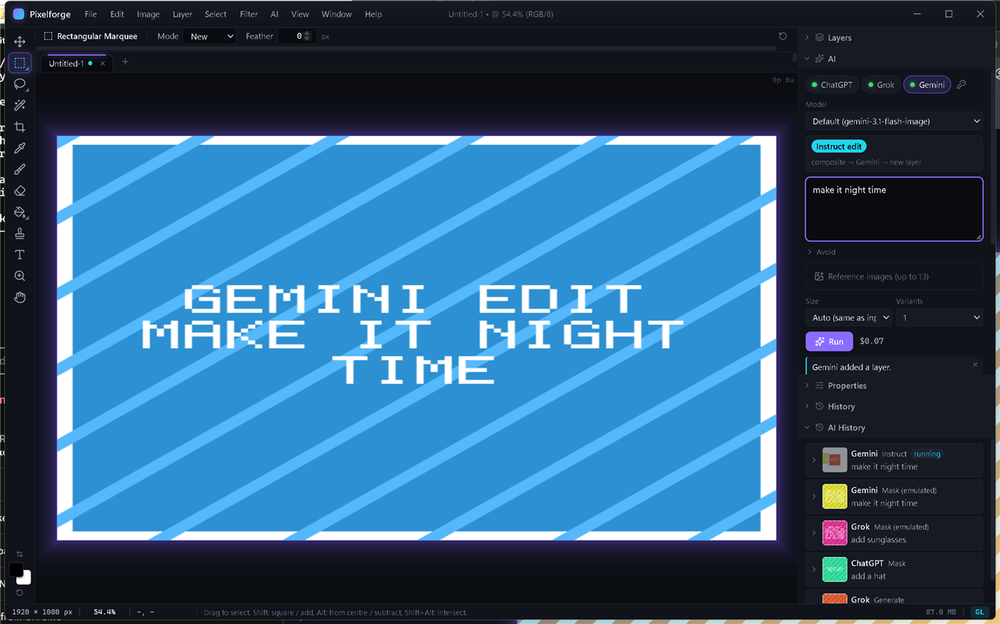
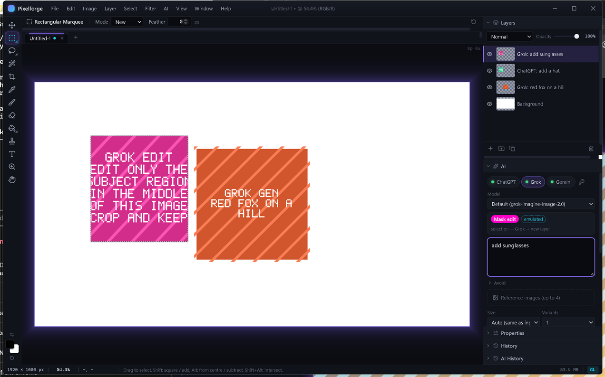
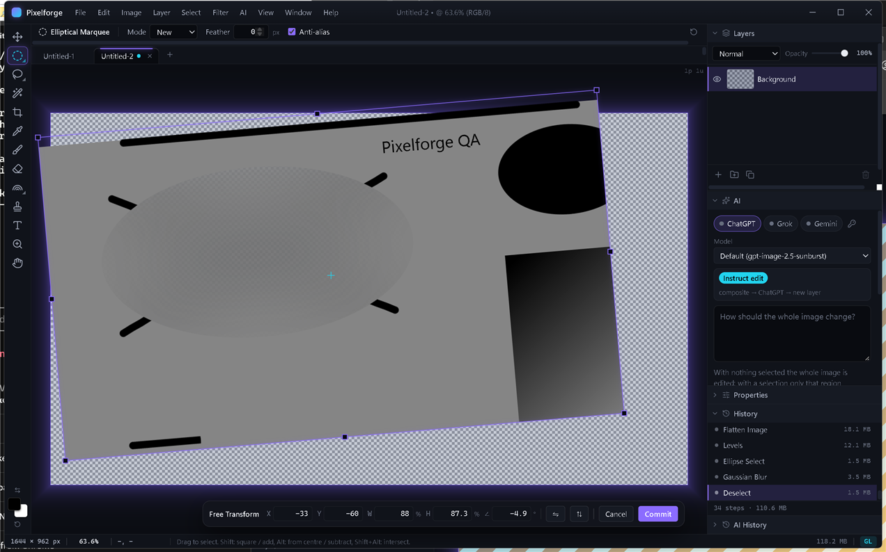
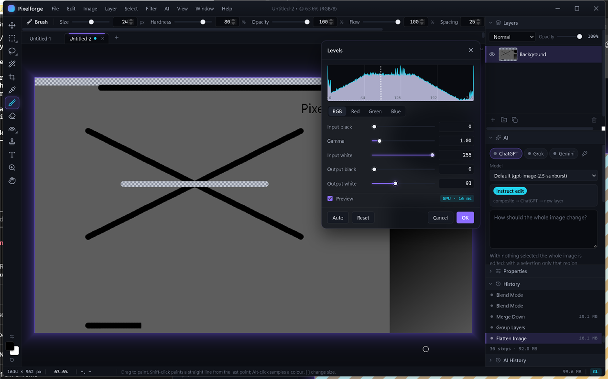

# Pixelforge

**Open-source, cross-platform raster image editor with first-class, chainable AI.**

Pixelforge is a Photoshop 7/8-style editor (layers, blend modes, selections, brushes,
adjustments, filters, free transform) built with Tauri 2, Svelte 5 and Rust. Pixels live
in the webview and are composited with WebGL2; Rust handles codecs, the project format,
PSD import, AI providers and OS integration.

MIT licensed. Windows, macOS and Linux. Current release: **0.1.0** (see
[CHANGELOG.md](CHANGELOG.md)).

## The pitch: chain three AI providers on one document

Most "AI image editors" lock you into one model. Pixelforge treats ChatGPT (OpenAI),
Grok (xAI) and Gemini (Google) as interchangeable **providers** behind one
`ImageProvider` trait, and every AI call takes the *current composite* of your document
as input. That makes chaining natural:

> Grok generates a base image -> you rough it in with the brush and a selection ->
> Gemini refines just the selected area -> ChatGPT adds the thing you forgot.

Every AI result lands on a **new layer** (never destructive), named after the provider
and prompt, so you can mask, blend, or throw it away. Providers without a native mask
endpoint get **mask emulation**: Pixelforge crops the composite to the selection's
bounding box, sends it with your instruction, and composites the result back only
inside the soft (feathered) mask. The workflow is identical no matter which model you pick.

An **AI History** panel records every job (provider, model, mode, prompt, thumbnails,
cost estimate, duration, status) inside the `.pfproj`, and lets you re-run it with a
different provider, edit the prompt and re-run, reveal the result layer, or toggle a
**diff overlay** that highlights the pixels the model changed.

## Screenshots

| Instruct edit (Gemini) with the diff-ready result on its own layer | Mask edit on a provider without a native mask (Grok, emulated) |
|---|---|
|  |  |

| Free Transform (scale + rotate, one undo step) | Levels with live preview and histogram |
|---|---|
|  |  |

The AI images above come from the bundled fake provider server (see Development), not
from a live model: they show the pipeline, not model quality.

## What works in 0.1.0

**Documents** — new (presets / custom, white / transparent / colour), open PNG / JPEG /
WebP / GIF / BMP / TIFF / **PSD (read-only, layers + groups + blend modes)**, save /
save-as `.pfproj` (layers, groups, blend modes, selection, AI history), export PNG /
JPEG / WebP, multiple tabs, recent files, drag-drop files onto the window, copy / paste
through the OS clipboard.

**Layers** — add, delete, duplicate, drag to reorder, rename, show / hide, lock,
opacity, all 16 Photoshop 7 blend modes, merge down, merge visible, flatten, one level
of groups.

**Tools** (Photoshop single-key shortcuts) — Move, Rectangular / Elliptical Marquee,
Lasso / Polygon Lasso, Magic Wand, Crop, Eyedropper, Brush, Eraser, Paint Bucket,
Gradient, Clone Stamp, Text, Zoom, Hand. Shift / Alt add, subtract and intersect
selections; marching ants; feather / expand / contract / inverse / select layer alpha.

**Adjustments & filters** (live preview, GPU with CPU fallback) — Brightness/Contrast,
Levels, Hue/Saturation, Color Balance, Invert, Desaturate, Threshold, Posterize;
Gaussian Blur, Motion Blur, Sharpen / Unsharp Mask, Add Noise, Pixelate; respects the
active selection.

**Image** — Image Size (bilinear / bicubic), Canvas Size (anchor grid), rotate / flip
canvas, Trim, Free Transform (Ctrl+T: scale, rotate, move, flip; Enter commits).

**Navigation** — smooth zoom (wheel, Ctrl+/-, fit, 100%), space-drag / middle-drag pan,
pixel grid at >= 800 %, unlimited undo with a memory budget, History panel with jump,
command palette (Ctrl+K) that reaches every menu item and tool.

**AI** — Generate, Mask edit (native on ChatGPT, emulated on Grok / Gemini), Instruct
edit, reference images, variants, cost estimate, cancel, typed errors (rate limit with
Retry-After, auth, moderation, timeout), AI History with re-run / edit-prompt / reveal /
diff.

Deferred to later releases: layer masks UI, adjustment layers, curves, editable text
layers, PSD export, local model providers, light theme. See [PLAN.md](PLAN.md).

## Bring your own keys (BYOK)

Pixelforge does not proxy AI calls through any server and has no account or
subscription of its own. You paste your own API keys (OpenAI, xAI, Google AI Studio)
into **Edit > AI API Keys** (or the key icon in the AI panel), and they are stored in
your OS keychain (Windows Credential Manager, macOS Keychain, Secret Service on Linux;
an obfuscated file is used only where no keychain exists). Keys never leave your machine
except in requests to the provider you chose. You pay the provider directly at their
published rates; Pixelforge shows a cost estimate per job.

Signing in with a ChatGPT / Grok / Gemini **subscription** instead of an API key is not
supported in 0.1.0: Google forbids subscription use of the API, xAI's subscription
OAuth is partner-only, and OpenAI's "Sign in with ChatGPT" is not yet documented for
image endpoints (details in `docs/ai-research.md`). Pixelforge will never ship
reverse-engineered auth.

## Building from source

Prerequisites on every platform:

- Rust stable (1.85+; `rustup` recommended - `rust-toolchain.toml` pins stable)
- Node.js 20+ and npm (this repo uses npm workspaces; **not** pnpm/yarn)
- Tauri CLI: either `cargo install tauri-cli --version "^2"` (gives `cargo tauri`) or
  just use the npm-installed `@tauri-apps/cli` via `npm run tauri`

### Windows

1. Install the [Microsoft C++ Build Tools](https://visualstudio.microsoft.com/visual-cpp-build-tools/)
   (Desktop development with C++) and the WebView2 runtime (preinstalled on Windows 11).
2. Use the **MSVC** Rust toolchain. `rust-toolchain.toml` pins `stable`, which rustup
   resolves against your *default host*; if that is `x86_64-pc-windows-gnu` the build
   picks the GNU toolchain and fails in C dependencies (`ring`). Check with `rustup show`
   and fix with `rustup set default-host x86_64-pc-windows-msvc`, or set
   `RUSTUP_TOOLCHAIN=stable-x86_64-pc-windows-msvc` in your shell
   (`$env:RUSTUP_TOOLCHAIN='stable-x86_64-pc-windows-msvc'` in PowerShell) before every
   `cargo` / `npm run tauri` command.
3. `npm install`
4. `npm run tauri dev` (first Rust compile takes a few minutes)
5. Installer: `npm run tauri build` -> `target/release/bundle/{msi,nsis}/`

### macOS

1. `xcode-select --install`
2. `npm install`
3. `npm run tauri dev`
4. App bundle / DMG: `npm run tauri build` -> `target/release/bundle/{macos,dmg}/`
   (unsigned; right-click > Open the first time, or `xattr -dr com.apple.quarantine`)

### Linux (Debian / Ubuntu)

Tauri 2 needs webkit2gtk **4.1**:

```sh
sudo apt-get update
sudo apt-get install -y libwebkit2gtk-4.1-dev build-essential curl wget file \
  libxdo-dev libssl-dev libayatana-appindicator3-dev librsvg2-dev
npm install
npm run tauri dev
```

Fedora: `sudo dnf install webkit2gtk4.1-devel openssl-devel curl wget file libappindicator-gtk3-devel librsvg2-devel`.
Arch: `sudo pacman -S --needed webkit2gtk-4.1 base-devel curl wget file openssl appmenu-gtk-module libappindicator-gtk3 librsvg`.

Installers: `npm run tauri build` -> `target/release/bundle/{deb,rpm,appimage}/`.

## Development

### Useful scripts (run from the repo root)

| Command | What it does |
|---|---|
| `npm run dev` | Vite dev server only (front end in a browser, no Tauri APIs) |
| `npm run tauri dev` | Full desktop app with hot reload |
| `npm run check` | `svelte-check` (TypeScript strict) |
| `npm test` | vitest (engine, tools, io, AI pipeline with mocked IPC) |
| `npm run build` | Vite production build to `app/dist` |
| `cargo test --workspace` | Rust tests (`pf-ai`, `pf-io`, app shell) |
| `cargo clippy --workspace --all-targets -- -D warnings` | Lints (CI enforces zero warnings) |
| `cargo fmt --all --check` | Formatting (CI enforces) |

`tauri::generate_context!()` embeds `app/dist`, so run `npm run build` once before a
plain `cargo build` / `cargo test` of the workspace. `npm run tauri dev` handles this
for you.

### Exercising the AI pipeline without spending money

`scripts/fake-ai-server.mjs` is a dependency-free Node server that answers the
generate / edit / key-test endpoints of all three providers with a valid-shape response
whose image is a coloured box with the prompt drawn in a bitmap font. The `pf-ai`
providers honour a base-URL override from the environment, so point the app at it:

```powershell
node scripts/fake-ai-server.mjs --port 8787      # in one terminal

$env:PF_AI_BASE_URL_OPENAI = "http://127.0.0.1:8787"
$env:PF_AI_BASE_URL_XAI    = "http://127.0.0.1:8787"
$env:PF_AI_BASE_URL_GEMINI = "http://127.0.0.1:8787"
npm run tauri dev                                 # in another
```

Save any non-empty key per provider in **Edit > AI API Keys** (a key starting with
`bad-` makes the key test fail with `ai_auth`). Prompt tokens simulate failures:
`!429` (rate limit with `Retry-After`), `!401`, `!500`, `!slow` (20 s, for testing
cancel) and `!block` (moderation). Options: `--size 512`, `--delay 1200`.

The override only changes the host; requests still carry the stored key. Leave the
variables unset for real providers.

### Layout

See [docs/architecture.md](docs/architecture.md), [docs/ipc.md](docs/ipc.md),
[docs/pfproj-format.md](docs/pfproj-format.md), [docs/ai-history.md](docs/ai-history.md)
and [PLAN.md](PLAN.md).

```
crates/pf-ai    AI provider trait + OpenAI / xAI / Gemini, job queue, key store (Rust)
crates/pf-io    codecs, PSD import, .pfproj project format, thumbnails (Rust)
app/src-tauri   Tauri shell: commands, state, plugins (Rust)
app/src/lib     engine (document, raster, selection, history, WebGL2 compositor),
                tools, filters, ai, io, stores, ui (Svelte 5)
scripts/        fake-ai-server.mjs
```

## Window chrome

Pixelforge draws its own dark title bar. On Windows and Linux the window is created with
`decorations: false` (see `app/src-tauri/tauri.conf.json`) and the bar is a
`data-tauri-drag-region`; minimize / maximize / close are driven from the front end with
`@tauri-apps/api/window`. On macOS the native traffic lights are kept
(`app/src-tauri/tauri.macos.conf.json` sets `titleBarStyle: "Overlay"`).

## License

MIT - see [LICENSE](LICENSE). Copyright (c) 2026 Paul Kircher.
