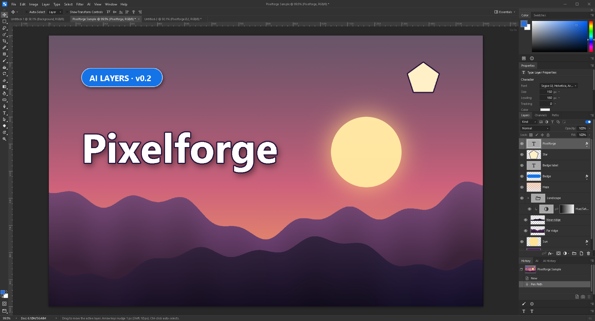
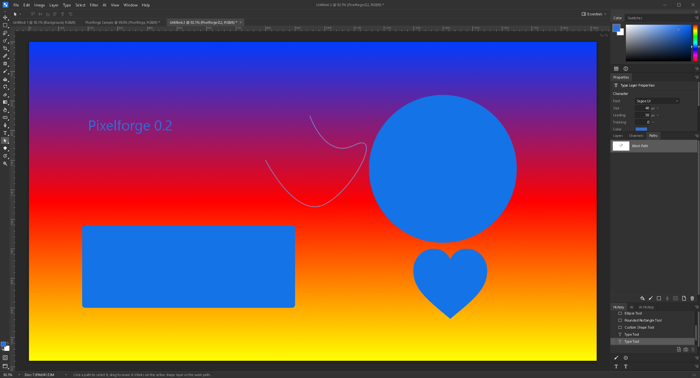
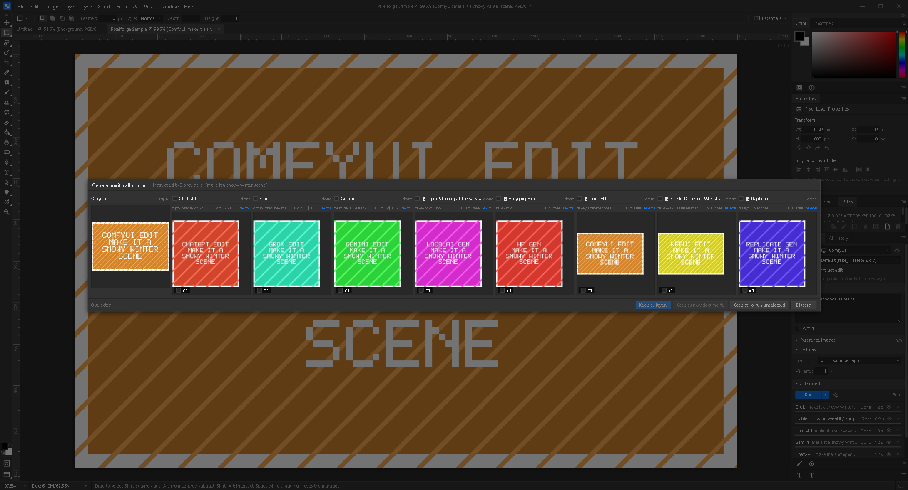

# Pixelforge

**Open-source, cross-platform raster image editor with first-class, chainable AI.**

Pixelforge is a Photoshop-style editor (masks, adjustment / fill / shape / type layers,
layer styles, channels, paths, the full Photoshop CC toolbar) built with Tauri 2,
Svelte 5 and Rust. Pixels live
in the webview and are composited with WebGL2; Rust handles codecs, the project format,
PSD import, AI providers and OS integration.

MIT licensed. Windows, macOS and Linux. Current release: **0.2.0** (see
[CHANGELOG.md](CHANGELOG.md)).

## The pitch: chain three AI providers on one document

Most "AI image editors" lock you into one model. Pixelforge treats ChatGPT (OpenAI),
Grok (xAI) and Gemini (Google) as interchangeable **providers** behind one
`ImageProvider` trait, and every AI call takes the *current composite* of your document
as input. That makes chaining natural:

> Grok generates a base image -> you rough it in with the brush and a selection ->
> Gemini refines just the selected area -> ChatGPT adds the thing you forgot.

Every AI result lands on a **new layer** (never destructive), named after the provider
and prompt, so you can mask, blend, or throw it away. Providers without a native mask
endpoint get **mask emulation**: Pixelforge crops the composite to the selection's
bounding box, sends it with your instruction, and composites the result back only
inside the soft (feathered) mask. The workflow is identical no matter which model you pick.

An **AI History** panel records every job (provider, model, mode, prompt, thumbnails,
cost estimate, duration, status) inside the `.pfproj`, and lets you re-run it with a
different provider, edit the prompt and re-run, reveal the result layer, or toggle a
**diff overlay** that highlights the pixels the model changed.

## Screenshots



| Layer Style: Bevel & Emboss + Outer Glow live on a type layer | Shapes, editable type and a Pen path in progress |
|---|---|
|  |  |



The AI images above come from the bundled fake provider servers (see Development), not
from live models: they show the pipeline, not model quality.

## What works in 0.2.0

0.2 is a Photoshop-fidelity overhaul: the UI follows Photoshop CC's dark theme, panel
layout, menus, tool groups and shortcuts, and the layer system works the way Photoshop's
does.

**Look & shell** — Photoshop CC medium-dark theme (optional light theme), custom
single-weight icon set, single-column toolbar with 20 grouped slots (right-click or
long-press for the fly-out; the letter key picks the group's tool, Shift+letter cycles),
context options bar per tool with presets, tabbed and dockable panel groups with ≡ panel
menus, collapse-to-icons, Window ▸ Workspace ▸ Reset Essentials, rulers, status bar with
document info popover, Preferences (Interface, Transparency & Gamut, Cursors, ...),
command palette (Ctrl+K) that reaches every menu item, tool and panel command.

**Layers** — pixel, group (pass-through), adjustment (Levels, Hue/Saturation, ... live in
the Properties panel), fill (solid / gradient / pattern), shape and editable type layers;
layer masks (Ctrl-click / Shift-click / Alt-click like PS), clipping masks (Ctrl+Alt+G),
Fill opacity, lock transparent / pixels / position / all, linking, color labels, layer
styles (Drop Shadow, Inner Shadow, Outer / Inner Glow, Bevel & Emboss, Stroke, Color /
Gradient Overlay) with a Photoshop-layout Layer Style dialog and style presets, all 16
blend modes, merge / flatten, arrange, Layers-panel filters and thumbnail options.
**Channels** (view R/G/B, alpha channels, save / load selection, Ctrl+2..6) and
**Paths** (work path, make selection, make work path from selection, fill / stroke path).

**Tools** — Move (auto-select, linked layers), Marquees incl. single row / column, Lasso /
Polygonal / Magnetic Lasso, Quick Selection, Magic Wand, Crop with Straighten,
Eyedropper / Color Sampler / Ruler, Spot Healing / Healing / Patch / Red Eye, Brush /
Pencil / Color Replacement with a real brush engine (custom sampled tips, scattering,
shape dynamics, ~30 presets), Clone / Pattern Stamp, History Brush, Eraser / Background /
Magic Eraser, Gradient (5 types, Gradient Editor) / Paint Bucket, Blur / Sharpen /
Smudge, Dodge / Burn / Sponge, Pen / Freeform / anchor tools, Path / Direct Selection,
Horizontal / Vertical Type and Type Masks, Rectangle / Rounded / Ellipse / Polygon /
Line / Custom Shape (shape layers or paths), Hand / Rotate View / Zoom, Quick Mask (Q),
Free Transform (Ctrl+T) for pixel, shape and type layers.

**Panels** — Color (hue cube) and the PS Color Picker, Swatches, Navigator, Info (with
color samplers and ruler), History (snapshots, history-brush source), Properties
(context-sensitive), Brush Settings, Brushes, Character, Paragraph, AI, AI History.

**Documents** — open PNG / JPEG / WebP / GIF / BMP / TIFF / PSD (read-only, layers +
groups + blend modes), save `.pfproj` (format 2: every layer kind, masks, effects,
clipping, channels, paths, AI history), export PNG / JPEG / WebP with effects, drag-drop,
clipboard, Image Size, Canvas Size, Image Rotation (incl. arbitrary), Trim, Fill
(color / pattern), Stroke, Paste in Place / Paste Into, Transform ▸ Again.

**AI** — Generate, Mask edit and Instruct edit with **ChatGPT, Grok and Gemini** plus
any number of **custom and local providers**: OpenAI-compatible servers (LocalAI, vLLM,
any hosted vendor that mimics OpenAI), Hugging Face (serverless router or a dedicated
Inference Endpoint), ComfyUI (bundled txt2img / img2img / inpaint workflows or your own),
Stable Diffusion WebUI / Forge, and Replicate. Edit ▸ AI Providers… tests connections,
fetches models / checkpoints and detects capabilities; local providers cost nothing.
**Shootout** (AI ▸ Generate with all models…, Ctrl+Shift+Alt+M or "Run on all models"):
one prompt fans out to every enabled provider, results stream into a gallery next to the
original; keep any of them as layers or new documents, or keep some and re-roll the rest.
The AI History records the shootout as one entry.

**About Ollama, honestly:** Ollama's API has no image-generation endpoint (its image
models are an experimental, macOS-only CLI feature that writes files; see
`docs/ai-research.md` §4.3). Pixelforge therefore uses Ollama only as a **✨ Improve
prompt** helper: a local vision model looks at your composite and rewrites the prompt.
It never produces the image itself.

Not in 0.2: smart objects, Curves point editing, Satin / Pattern Overlay effects, warped
text, PSD export, actions. See [PLAN-v2.md](PLAN-v2.md).
## Bring your own keys (BYOK)

Pixelforge does not proxy AI calls through any server and has no account or
subscription of its own. You paste your own API keys (OpenAI, xAI, Google AI Studio)
into **Edit > AI Providers…** (or the gear next to the provider in the AI panel), and they are stored in
your OS keychain (Windows Credential Manager, macOS Keychain, Secret Service on Linux;
an obfuscated file is used only where no keychain exists). Keys never leave your machine
except in requests to the provider you chose. You pay the provider directly at their
published rates; Pixelforge shows a cost estimate per job.

Signing in with a ChatGPT / Grok / Gemini **subscription** instead of an API key is not
supported in 0.2.0: Google forbids subscription use of the API, xAI's subscription
OAuth is partner-only, and OpenAI's "Sign in with ChatGPT" is not yet documented for
image endpoints (details in `docs/ai-research.md`). Pixelforge will never ship
reverse-engineered auth.

## Building from source

Prerequisites on every platform:

- Rust stable (1.85+; `rustup` recommended - `rust-toolchain.toml` pins stable)
- Node.js 20+ and npm (this repo uses npm workspaces; **not** pnpm/yarn)
- Tauri CLI: either `cargo install tauri-cli --version "^2"` (gives `cargo tauri`) or
  just use the npm-installed `@tauri-apps/cli` via `npm run tauri`

### Windows

1. Install the [Microsoft C++ Build Tools](https://visualstudio.microsoft.com/visual-cpp-build-tools/)
   (Desktop development with C++) and the WebView2 runtime (preinstalled on Windows 11).
2. Use the **MSVC** Rust toolchain. `rust-toolchain.toml` pins `stable`, which rustup
   resolves against your *default host*; if that is `x86_64-pc-windows-gnu` the build
   picks the GNU toolchain and fails in C dependencies (`ring`). Check with `rustup show`
   and fix with `rustup set default-host x86_64-pc-windows-msvc`, or set
   `RUSTUP_TOOLCHAIN=stable-x86_64-pc-windows-msvc` in your shell
   (`$env:RUSTUP_TOOLCHAIN='stable-x86_64-pc-windows-msvc'` in PowerShell) before every
   `cargo` / `npm run tauri` command.
3. `npm install`
4. `npm run tauri dev` (first Rust compile takes a few minutes)
5. Installer: `npm run tauri build` -> `target/release/bundle/{msi,nsis}/`

### macOS

1. `xcode-select --install`
2. `npm install`
3. `npm run tauri dev`
4. App bundle / DMG: `npm run tauri build` -> `target/release/bundle/{macos,dmg}/`
   (unsigned; right-click > Open the first time, or `xattr -dr com.apple.quarantine`)

### Linux (Debian / Ubuntu)

Tauri 2 needs webkit2gtk **4.1**:

```sh
sudo apt-get update
sudo apt-get install -y libwebkit2gtk-4.1-dev build-essential curl wget file \
  libxdo-dev libssl-dev libayatana-appindicator3-dev librsvg2-dev
npm install
npm run tauri dev
```

Fedora: `sudo dnf install webkit2gtk4.1-devel openssl-devel curl wget file libappindicator-gtk3-devel librsvg2-devel`.
Arch: `sudo pacman -S --needed webkit2gtk-4.1 base-devel curl wget file openssl appmenu-gtk-module libappindicator-gtk3 librsvg`.

Installers: `npm run tauri build` -> `target/release/bundle/{deb,rpm,appimage}/`.

## Development

### Useful scripts (run from the repo root)

| Command | What it does |
|---|---|
| `npm run dev` | Vite dev server only (front end in a browser, no Tauri APIs) |
| `npm run tauri dev` | Full desktop app with hot reload |
| `npm run check` | `svelte-check` (TypeScript strict) |
| `npm test` | vitest (engine, tools, io, AI pipeline with mocked IPC) |
| `npm run build` | Vite production build to `app/dist` |
| `cargo test --workspace` | Rust tests (`pf-ai`, `pf-io`, app shell) |
| `cargo clippy --workspace --all-targets -- -D warnings` | Lints (CI enforces zero warnings) |
| `cargo fmt --all --check` | Formatting (CI enforces) |

`tauri::generate_context!()` embeds `app/dist`, so run `npm run build` once before a
plain `cargo build` / `cargo test` of the workspace. `npm run tauri dev` handles this
for you.

### Exercising the AI pipeline without spending money

`scripts/fake-ai-server.mjs` is a dependency-free Node server that answers the
generate / edit / key-test endpoints of all three providers with a valid-shape response
whose image is a coloured box with the prompt drawn in a bitmap font. The `pf-ai`
providers honour a base-URL override from the environment, so point the app at it:

```powershell
node scripts/fake-ai-server.mjs --port 8787      # in one terminal

$env:PF_AI_BASE_URL_OPENAI = "http://127.0.0.1:8787"
$env:PF_AI_BASE_URL_XAI    = "http://127.0.0.1:8787"
$env:PF_AI_BASE_URL_GEMINI = "http://127.0.0.1:8787"
npm run tauri dev                                 # in another
```

Save any non-empty key per provider in **Edit > AI Providers…** (a key starting with
`bad-` makes the key test fail with `ai_auth`). Prompt tokens simulate failures:
`!429` (rate limit with `Retry-After`), `!401`, `!500`, `!slow` (20 s, for testing
cancel) and `!block` (moderation). Options: `--size 512`, `--delay 1200`.

The override only changes the host; requests still carry the stored key. Leave the
variables unset for real providers.

`scripts/fake-local-ai.mjs` fakes every **custom / local** provider kind on one port
(OpenAI-compatible, Hugging Face, Ollama, ComfyUI, Stable Diffusion WebUI / Forge,
Replicate). Start it and add each kind in **Edit > AI Providers…** with the base URL
from the table in the script header:

```powershell
node scripts/fake-local-ai.mjs --port 8790       # all custom kinds, e.g. http://127.0.0.1:8790
```

It honours the same `!429` / `!401` / `!500` / `!slow` / `!block` prompt tokens. With
both servers running you can exercise the whole AI surface — custom providers, the
shootout in generate / mask / instruct mode, Improve prompt via the fake Ollama — without
any account. Help ▸ Open Sample Document gives you a rich layered scene to work on.

### Layout

See [docs/architecture.md](docs/architecture.md), [docs/ipc.md](docs/ipc.md),
[docs/pfproj-format.md](docs/pfproj-format.md), [docs/ai-history.md](docs/ai-history.md)
and [PLAN.md](PLAN.md).

```
crates/pf-ai    AI provider trait + OpenAI / xAI / Gemini + custom kinds, job queue, key store (Rust)
crates/pf-io    codecs, PSD import, .pfproj project format, thumbnails (Rust)
app/src-tauri   Tauri shell: commands, state, plugins (Rust)
app/src/lib     engine (document, raster, selection, history, WebGL2 compositor),
                tools, filters, ai, io, stores, ui (Svelte 5)
scripts/        fake-ai-server.mjs (built-in providers), fake-local-ai.mjs (custom / local kinds)
```

## Window chrome

Pixelforge draws its own dark title bar. On Windows and Linux the window is created with
`decorations: false` (see `app/src-tauri/tauri.conf.json`) and the bar is a
`data-tauri-drag-region`; minimize / maximize / close are driven from the front end with
`@tauri-apps/api/window`. On macOS the native traffic lights are kept
(`app/src-tauri/tauri.macos.conf.json` sets `titleBarStyle: "Overlay"`).

## License

MIT - see [LICENSE](LICENSE). Copyright (c) 2026 Paul Kircher.
